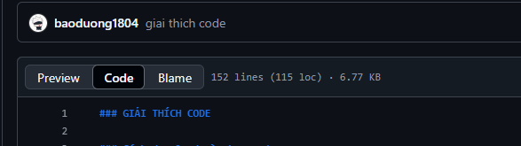
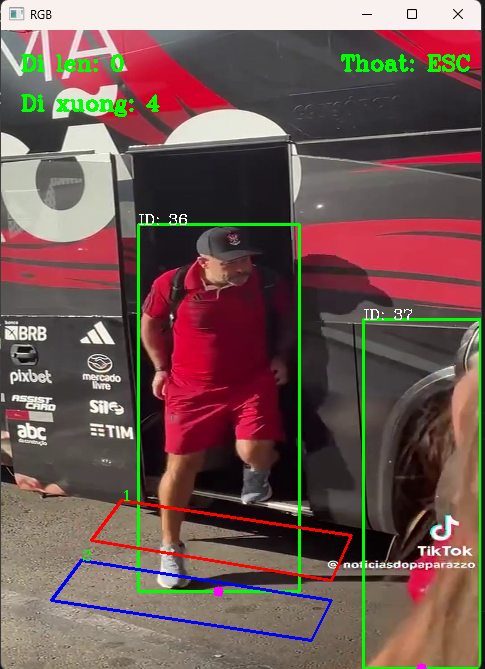

### GIẢI THÍCH CODE
Thấy khó đọc quá ae ấn phía bên code nha

### Cách download và chạy code:
- B1 : Vào link source code  : https://github.com/baoduong1804/project_count_people
- B2 : Ấn vào nút <>Code màu xanh lá  . Rồi ấn download ZIP  
- B3 : Giải nén file rồi nhấn vào file
- B4 : Ấn chuột phải xong chọn Open in Terminal  (Nếu chưa tải IDE : Python thì ae lên gg tải nha)
- B4 : Dán vào terminal (tải thư viện) :  pip install opencv-python opencv-python-headless pandas numpy ultralytics norfair
- B5 : Tải thư viện xong --> Chạy code nhập: py main.py     ---> Nhấn phím ESC để thoát chương trình.

### Cách thức hoạt động 
1. Khai báo thư viện
import cv2 :  thư viện OpenCV
import pandas as pd  : thư viện Pandas
import numpy as np  :thư viện NumPy
from ultralytics import YOLO  : thư viện Ultralytics YOLO
from tracker import*  : import từ file tracker.py 

2. Khởi tạo và chuẩn bị dữ liệu
-YOLO('yolov8s.pt') : Sử dụng mô hình YOLOv8 để phát hiện người trong video.

-Vùng khảo sát (hai vùng hình bình hành trên video): Đây là các khu vực khảo sát trên video, được định nghĩa bởi các tọa độ.
area1 = [(120,470),(90,510),(330,550),(350,505)] 
area2 = [(80,530),(50,570),(310,610),(330,570)]
  
-Kích thước video suất ra 480x640 : frame=cv2.resize(frame,(480 ,640)) 

ví dụ : area1 = [A,B,C,D] -->  A,B,C,D là các tọa độ của hình bình hành (A = (120,470),...)
  (0,0)
    . --------------> trục xmax= 480
    |
    |      A -------- D
    |     /          /
    |     B  -------C
    |
    \/
    trục y  ymax=640

-File coco.txt: Chứa danh sách các nhãn (labels) mà YOLO có thể nhận diện, ví dụ: "person", "car", "bicycle",...

-File tracker.py: 
Gán ID duy nhất cho từng đối tượng trong khung hình.
Theo dõi và cập nhật tọa độ trung tâm của các đối tượng qua các khung hình kế tiếp.
Xóa ID cũ của các đối tượng không còn xuất hiện nữa.
--> Giữ ID duy nhất cho mỗi đối tượng, giúp theo dõi chúng qua các khung hình.

-File pycache: chứa các file biên dịch (bytecode) của Python, giúp làm tăng tốc độ khởi động của chương trình và giảm thời gian biên dịch lại mã nguồn khi chạy lại chương trình.

3. Xử lý video
- Đọc video và giảm tải xử lý: Chỉ xử lý khung hình chẵn để tăng hiệu suất.

ret, frame = cap.read()
if count % 2 != 0:
    continue

- Dự đoán bounding boxes (là hình chữ nhật xác định kích thước và vị trí vật thể trong video):

results = model.predict(frame)
Phát hiện các đối tượng trong video và trả về tọa độ của bounding boxes.
Một bounding box được xác định bởi hai tọa độ chính:

Tọa độ góc trên bên trái: (x1, y1)
Tọa độ góc dưới bên phải: (x2, y2)
Kích thước hình chữ nhật này:
Chiều rộng = x2 - x1
Chiều cao = y2 - y1

4. Theo dõi và phân loại
- -Dùng tracker để gán ID: bbox_id = tracker.update(list)
Tracker sẽ gán ID cho mỗi đối tượng dựa trên bounding box.

- Phân loại người đi lên và đi xuống:
Đi lên
results = cv2.pointPolygonTest(np.array(area2,np.int32),(((x4+x3)//2,y4)),False)
if results >= 0:
    people_upping[id] = (x4, y4)
if id in people_upping:
    results1 = cv2.pointPolygonTest(np.array(area1,np.int32),(((x4+x3)//2,y4)),False)
    if results1 >= 0:
        upping.add(id)

---> Nếu đối tượng di chuyển từ area2 đến area1 (điểm chấm màu hồng phía dưới mỗi người di chuyển từ area2 đến area1) , ID của nó sẽ được thêm vào upping

Đi xuống:

results2 = cv2.pointPolygonTest(np.array(area1,np.int32),(((x4+x3)//2,y4)),False)
if results2 >= 0:
    people_downing[id] = (x4, y4)
if id in people_downing:
    results3 = cv2.pointPolygonTest(np.array(area2,np.int32),(((x4+x3)//2,y4)),False)
    if results3 >= 0:
        downing.add(id)
Nếu đối tượng di chuyển từ area1 đến area2 (điểm chấm màu hồng phía dưới mỗi người di chuyển từ area1 đến area2), ID của nó sẽ được thêm vào downing

5. Vẽ và hiển thị kết quả
- Vẽ bounding box và ID người:
cv2.rectangle(frame, (x3, y3), (x4, y4), (0,255,0), 2)
cv2.putText(frame, str(id), (x3, y3), cv2.FONT_HERSHEY_COMPLEX, 0.5, (255,255,255), 1)

- Vẽ chấm màu hồng phía dưới bounding box 
cv2.circle(frame,((x4+x3)//2 ,y4),5,(255,0,255),-1) 
(x4+x3)//2: tọa độ x của trung điểm của đáy hình chữ nhật
y4 : tọa độ y của hình chữ nhật 
bán kính là: 5
Màu sắc của hình tròn: (255, 0, 255) (màu hồng, theo hệ màu BGR)
Độ dày đường viền. Nếu là -1, hình tròn sẽ được tô đầy màu.

- Vẽ vùng khảo sát:
cv2.polylines(frame, [np.array(area1, np.int32)], True, (0, 0, 255), 2)
cv2.putText(frame, str('1'), area1[0], cv2.FONT_HERSHEY_COMPLEX, 0.5, (0,255,0), 1)

-Hiển thị số người đi lên, đi xuống:
cv2.putText(frame, str(f"Di len: {up}"), (20, 40), cv2.FONT_HERSHEY_COMPLEX, 0.7, (0, 255, 0), 2)
cv2.putText(frame, str(f"Di xuong: {down}"), (20, 80), cv2.FONT_HERSHEY_COMPLEX, 0.7, (0, 255,0), 2)

6. Hiển thị
- Hiển thị video và thoát:
cv2.imshow("RGB", frame)
if cv2.waitKey(1) & 0xFF == 27:
    break
Video được hiển thị từng khung hình.
Nhấn phím ESC để thoát chương trình.

7. Nguồn tham khảo
Youtube: https://www.youtube.com/watch?v=tbscP_d11Zw&list=LL&index=2&t=1768s

8. Thuật toán cơ bản
- Dùng YOLOV8S để phát hiện đối tượng trong video
- tracker để theo dõi và gán id từng người
- dùng openCV để vẽ bounding boxes từ đó xác định được điểm khảo xác của từng đối tượng( điểm màu hồng phía dưới) , Vẽ 2 khu vực khảo xác area1 và area2 .

- Kiểm tra điểm khảo xác có nằm trong vung khảo xác không: 
+ Nếu điểm khảo xác nằm ngoài vùng khảo xác thì return -1.0 
+ Nếu điểm khảo xác di chuyển vào vùng khảo xác thì return 1.0 
--> Từ đó xác định được điểm khảo xác có đang ở trong khu vực khảo xác hay không

- Kiểm tra người đi lên hay đi xuống:
+ Nếu điểm khảo xác đi từ area2 đến area1 thì xác định người đó đi lên (thêm id người đó vào list: upping )
+ Nếu điểm khảo xác đi từ area1 đến area2 thì xác định người đó đi xuống (thêm id người đó vào list: downing )
--> lấy độ dài của từng cái list trên ta được số lượng người đi lên và đi xuống

- In kết quả ra màn hình

Hình minh họa:

